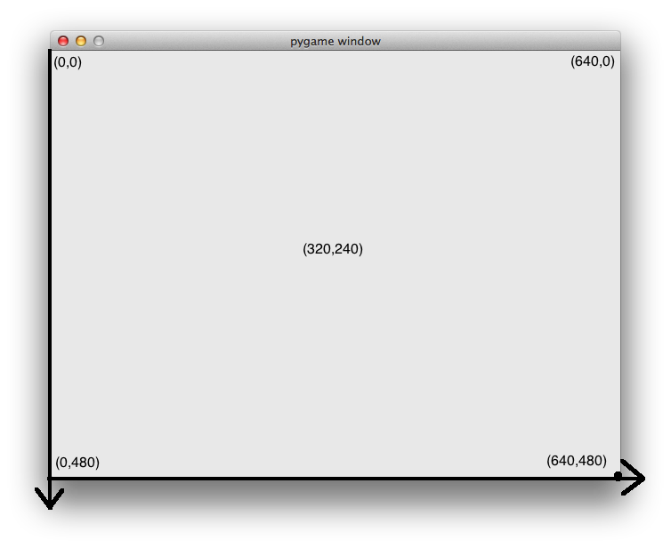
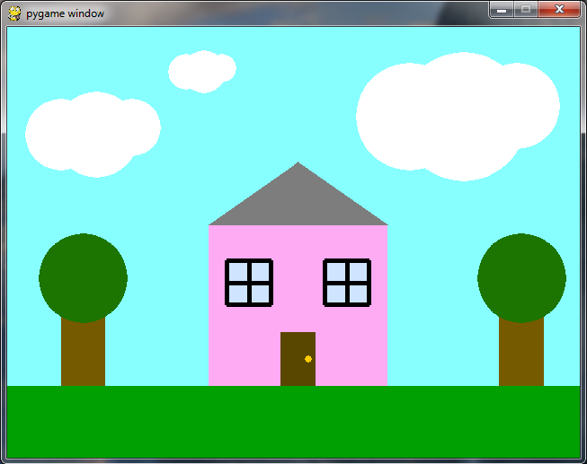

Note: You cannot use [repl.it](http://repl.it/) for this session.  Make sure you've [installed everything](https://github.com/CoderDojoSV/beginner-python/blob/master/Day-1/README.md#installation) before you come to the session.

You can check if you have pygame installed by typing `import pygame` in the shell and hitting enter. If you have it setup, it will not do anything. If you don't, you will get an error.

##Starting out with Pygame

**Do not name your file pygame.py!** IDLE will think your file is the `pygame` module we are trying to use, which won't work!

We can start out by telling Pygame to open a window.  This will give us a place to draw things on the screen.

    import pygame
    pygame.init()
    screen = pygame.display.set_mode((640,480))

If you tried running that code, you might notice that it doesn't work too well.  Depending on your computer, it might have frozen, crashed, or opened a window and closed it really fast.  This is because the program doesn't have an *event loop* - a way to tell the program how to keep the window open and respond to things the user does.

Here's what our code looks like with an event loop added:

    import pygame
    pygame.init()
    screen = pygame.display.set_mode((640,480))
    
    running = True
    while running:
        for event in pygame.event.get():
            if event.type == pygame.QUIT:
                running = False
    pygame.quit()

##The coordinate grid

Pygame uses a coordinate system to describe where things are on the screen.  (0,0) is the top-left and (640,480) is the bottom right, and anything in between is somewhere inside the window.

##Drawing Shapes

We can use Pygame to draw lines, rectangles, and circles on the screen.

Start with this code:

    import pygame
    pygame.init()
    screen = pygame.display.set_mode((640,480))

    screen.fill((0,0,0))

    pygame.draw.line(screen,pygame.color.THECOLORS['white'],(500,450),(400,300))
    pygame.draw.circle(screen,pygame.color.THECOLORS['white'],(300,300),50)
    pygame.draw.rect(screen,pygame.color.THECOLORS['white'],(200,100,50,100))

    pygame.display.flip()

    running = True
    while running:
        for event in pygame.event.get():
            if event.type == pygame.QUIT:
                running = False
    pygame.quit()

####Challenge 1
Can you change the color of all the shapes?

####Challenge 2
Can you make the circle twice as big?

####Challenge 3
Can you make the line go from the bottom left corner of the screen all the way to the top right?

####Challenge 4
Can you make another rectangle that is short and fat?

We can also have shapes that aren't filled in:

    import pygame
    pygame.init()
    screen = pygame.display.set_mode((640,480))

    screen.fill((0,0,0))

    pygame.draw.line(screen,pygame.color.THECOLORS['red'],(500,450),(400,300),6)
    pygame.draw.circle(screen,pygame.color.THECOLORS['blue'],(300,300),50,4)
    pygame.draw.rect(screen,pygame.color.THECOLORS['green'],(200,100,50,100),8)

    pygame.display.flip()

    running = True
    while running:
        for event in pygame.event.get():
            if event.type == pygame.QUIT:
                running = False
    pygame.quit()

####Challenge 5
Can you make another rectangle inside the existing one that has a thinner border?

##Drawing Random Shapes

We can combine random and pygame to create art!  Take a look at the starter file [random drawing.py](random drawing.py).

How can we change the art the program creates?  Try changing the program to draw thicker lines and different numbers of lines.

More Challenges:
 - Can you change the program so it also draws circles?
 - How about rectangles?
 - Can you change the program so it adds shapes to the screen one at a time? You can use `pygame.time.delay(20)` to pause for a bit

##Take Home Challenge

Draw your own picture! Go to http://colorpicker.com/ to determine the RGB values for different colors to use in your image. [Here is the finished code](finished/house drawing.py) for drawing this image: 

